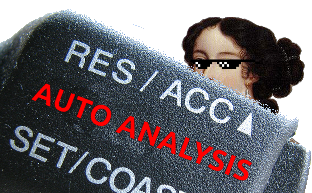

# IDA_AutoAnalysis

Automatically renames IDA function based on functionality when loaded in IDA Pro.  
*It's like AutoRE - https://github.com/a1ext/auto_re*

Functions are renamed to [FLAGS]_sub_0034C30SB.  Ex: RF_sub_0034C30SB -  function uses API calls related to file and registy operations. 

| Flag | Description                            |
|------|----------------------------------------|
| F    | File I/O API calls                     |
| R    | Registry modification                  |
| U    | Net User functions                     |
| S    | Socket API calls                       |
| C    | Windows native cryptographic functions |
| M    | Memory allocation / copy / move / etc  |
